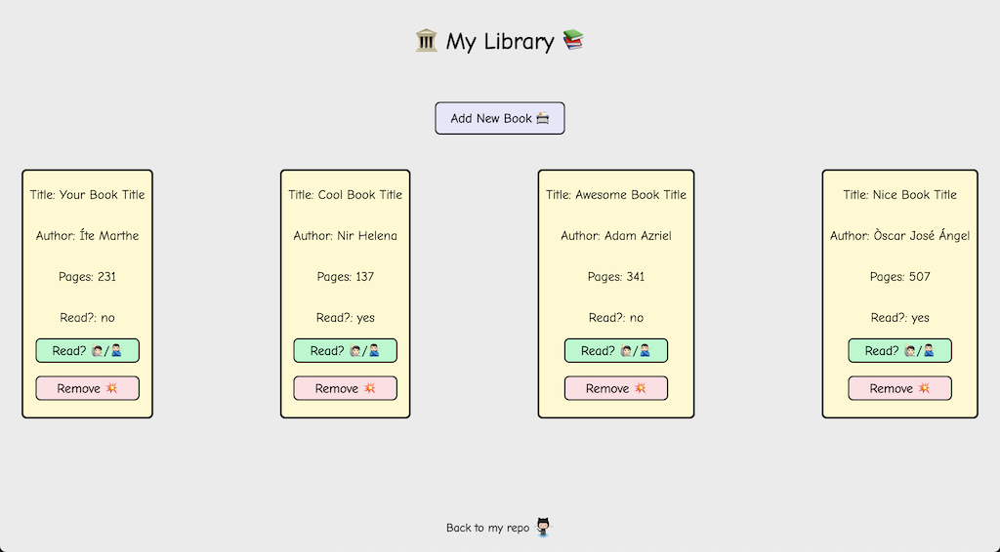

# Library Project

Live Demo: https://ts-oh.github.io/library/

## Screenshots

## This is a Library project from 'The Odin Project'

- Used: JavaScript, CSS, and HTML.

- Implementation:

  - [x] All of your book objects are going to be stored in a simple array, so add a function to the script (not the constructor) that can take the user’s input and store the new book objects into an array.

  - [x] Create a function that loops through the array and displays each book on the page. You can display them on some sort of table, or each on their own “card”.

  - [x] Add a “NEW BOOK” button that brings up a form allowing users to input the details for the new book: author, title, number of pages, whether it’s been read.

  - [x] Add a button on each book’s display to remove the book from the library.

  - [x] Associate your DOM elements with the actual book objects in some way. One easy solution is giving them a data attribute that corresponds to the index of the library array.

  - [x] Add a button on each book’s display to change its read status on the Book prototype instance.

### Lessons/Comments

This project involved creating a constructor (later class syntax) to create instances of book objects. The initial challenges that I faced were how to create a new book object by receiving values from the user. Other challenges included were how to change the read status on the object and deleting specific books through DOM manipulation. Overall, I had enjoyed making this since the project was practical and I could see how some of these aspects are seen in real-world applications.
